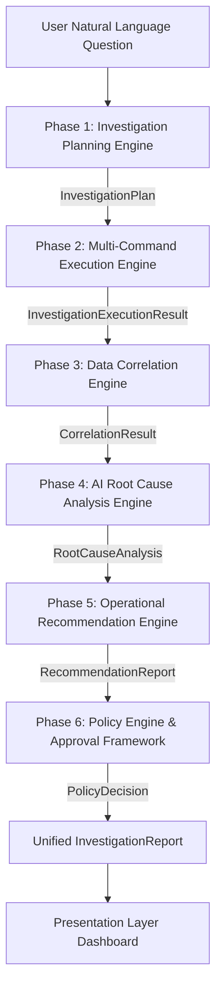

# 🛡️ Autonomous AI SRE Platform

> **A Production-Grade Autonomous Site Reliability Engineering (SRE) Platform for Incident Investigation, Multi-Command Execution, Correlation, Root Cause Analysis, Operational Guidance, and Policy Governance.**

---

## 🏗️ 1. Platform Architecture Overview

The platform is designed following **Clean Architecture**, **Domain-Driven Design (DDD)**, and **SOLID** engineering principles. The core business logic is completely decoupled from external infrastructure (Paramiko SSH, PostgreSQL, Gemini/LLM APIs, Streamlit).

```text
User Request
     │
     ▼
┌─────────────────────────────────────────────────────────┐
│ PRESENTATION LAYER                                      │
│ (Streamlit Web Dashboard / CLI Application)             │
└────────────────────────────┬────────────────────────────┘
                             │
                             ▼
┌─────────────────────────────────────────────────────────┐
│ APPLICATION LAYER (InvestigationWorkflow)               │
│ Orchestrates Use Cases: P1 -> P2 -> P3 -> P4 -> P5 -> P6│
└────────────────────────────┬────────────────────────────┘
                             │
                             ▼
┌─────────────────────────────────────────────────────────┐
│ DOMAIN LAYER (Pure Business Models, Rules & Interfaces) │
│ Investigation | Execution | Correlation | RCA | Policy  │
└────────────────────────────┬────────────────────────────┘
                             │
                             ▼
┌─────────────────────────────────────────────────────────┐
│ INFRASTRUCTURE LAYER                                    │
│ Paramiko SSH | PostgreSQL Audit | Gemini LLM Provider    │
└─────────────────────────────────────────────────────────┘
```

---

## 🔄 2. End-to-End Investigation Pipeline (Phases 1 - 6)



---

## 📁 3. Directory Structure

```text
e:\paramiko\
├── app.py                      # Main backend entrypoint
├── run.py                      # CLI entrypoint
├── frontend.py                 # Streamlit UI entrypoint
├── application/                # Use case orchestrators (DI driven)
│   ├── workflow/               # InvestigationWorkflow (Phases 1-6)
│   ├── investigation/          # Phase 1 planning app services
│   ├── execution/              # Phase 2 multi-command execution
│   ├── correlation/            # Phase 3 data correlation
│   ├── rca/                    # Phase 4 AI Root Cause Analysis
│   ├── recommendation/         # Phase 5 operational recommendation
│   └── policy/                 # Phase 6 policy engine & approvals
├── domain/                     # Pure domain logic, models, interfaces, rules
│   ├── investigation/          # Phase 1 domain (Planner, Rules, Templates)
│   ├── execution/              # Phase 2 domain (Step & Execution Models)
│   ├── correlation/            # Phase 3 domain (Findings, Rules, Evidence)
│   ├── rca/                    # Phase 4 domain (RCA Models, AI Gateway)
│   ├── recommendation/         # Phase 5 domain (Recommendation Models)
│   ├── policy/                 # Phase 6 domain (Policy Rules, Decisions)
│   └── report/                 # Unified InvestigationReport model
├── infrastructure/            # External integrations & implementations
│   ├── ssh/                    # Paramiko SSH Client (ISSHClient)
│   ├── llm/                    # Gemini RCA & Recommendation Providers
│   ├── registry/               # Linux Command & Parser Registries
│   └── persistence/            # PostgreSQL Audit Repository
├── presentation/               # Streamlit UI & CLI interfaces
│   ├── streamlit/              # Streamlit Web Dashboard
│   └── cli/                    # Terminal CLI Application
└── shared/                     # Cross-cutting concerns
    ├── config/                 # Central Settings (PlatformSettings)
    ├── logging/                # Structured Logger (get_logger)
    └── exceptions/             # Global Platform Exceptions
```

---

## 🔌 4. Dependency Injection & Vendor Abstraction

1. **LLM Provider Abstraction**:
   Business logic depends on `LLMProviderInterface` and `RecommendationProviderInterface`. Concrete implementations (`GeminiRCAProvider`, `GeminiRecommendationProvider`) live in `infrastructure/llm/`.
2. **SSH Abstraction**:
   Execution engine depends on `ISSHClient`. Concrete Paramiko implementation (`ParamikoSSHClient`) lives in `infrastructure/ssh/`.
3. **Persistence Abstraction**:
   Audit logging depends on `PostgresAuditRepository` in `infrastructure/persistence/`.

---

## 🚀 5. How to Run the Platform

### **Run Web Dashboard (Streamlit)**
```powershell
.\myvenv\Scripts\streamlit.exe run frontend.py
```

### **Run Terminal CLI**
```powershell
.\myvenv\Scripts\python.exe run.py "Why is my server slow?"
```
