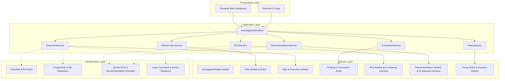
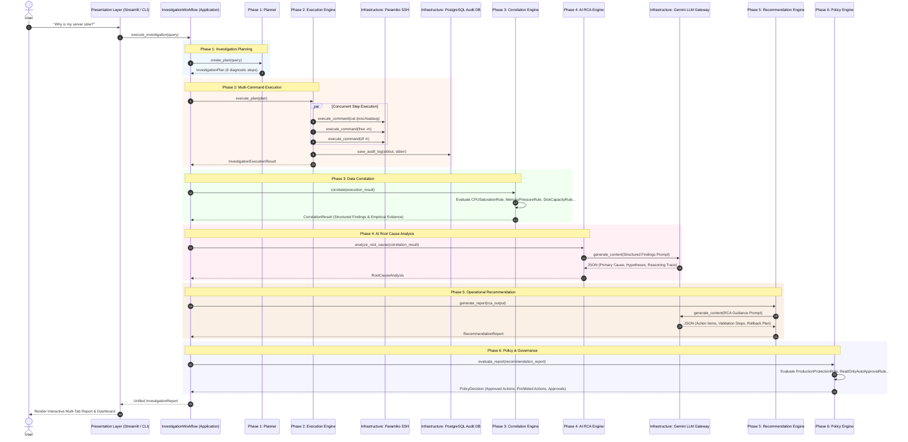

# 🛡️ Autonomous AI SRE Platform for Autonomous Operations

> **A Production-Grade Autonomous Site Reliability Engineering (SRE) Platform for Incident Investigation, Multi-Command Execution, Data Correlation, AI Root Cause Analysis, Operational Guidance, and Policy Governance.**

---

## 📌 1. Executive Overview

The **Autonomous AI SRE Platform** is an enterprise-grade autonomous incident investigation engine designed to emulate the reasoning and troubleshooting methodology of an experienced Senior Site Reliability Engineer (SRE).

When a natural language query (e.g., *"Why is my server slow and unresponsive?"*) is submitted, the platform executes a deterministic, 6-phase autonomous workflow:

```text
User Natural Language Question
              │
              ▼
┌──────────────────────────────────────────────┐
│  Phase 1: Investigation Planning Engine      │ ➔ Builds InvestigationPlan (No SSH)
└─────────────────────┬────────────────────────┘
                      │
                      ▼
┌──────────────────────────────────────────────┐
│  Phase 2: Multi-Command Execution Engine     │ ➔ Executes steps over SSH concurrently
└─────────────────────┬────────────────────────┘
                      │
                      ▼
┌──────────────────────────────────────────────┐
│  Phase 3: Data Correlation Engine            │ ➔ Synthesizes findings & evidence (No AI)
└─────────────────────┬────────────────────────┘
                      │
                      ▼
┌──────────────────────────────────────────────┐
│  Phase 4: AI Root Cause Analysis Engine      │ ➔ AI reasons over structured findings
└─────────────────────┬────────────────────────┘
                      │
                      ▼
┌──────────────────────────────────────────────┐
│  Phase 5: Operational Recommendation Engine  │ ➔ Formulates guidance & rollback plans
└─────────────────────┬────────────────────────┘
                      │
                      ▼
┌──────────────────────────────────────────────┐
│  Phase 6: Policy Engine & Approval Framework │ ➔ Evaluates safety & approval matrix
└─────────────────────┬────────────────────────┘
                      │
                      ▼
         Unified InvestigationReport
```

---

## 🏗️ 2. Clean Architecture & Layering

The codebase strictly adheres to **Clean Architecture**, **Domain-Driven Design (DDD)**, and **SOLID** principles. Core business logic is isolated in the `domain/` layer and has **zero dependencies** on external frameworks, database drivers, or AI vendor SDKs.



---

## 🔄 3. End-to-End Execution Sequence Flow

The following sequence diagram demonstrates the flow of data through the platform for an incident investigation query:



---

## 📑 4. Phase-by-Phase Architectural Breakdown

### **Phase 0 — Infrastructure Core & Registries**
- **SSH Client (`infrastructure/ssh/`)**: Implements `ISSHClient` via `ParamikoSSHClient` for remote command execution over Paramiko.
- **Linux Command Registry (`infrastructure/registry/command_registry.py`)**: Central whitelisted registry mapping command keys (`cpu_load`, `memory_usage`, `disk_usage`) to bash commands.
- **Linux Parser Registry (`infrastructure/registry/parser_registry.py`)**: Text parsing registry converting raw terminal stdout into structured JSON dictionaries.
- **Audit Persistence Repository (`infrastructure/persistence/audit_repository.py`)**: `PostgresAuditRepository` logging audit records to PostgreSQL (`ssh_command_logs` table).

---

### **Phase 1 — Investigation Planning Engine (`domain/investigation/` & `application/investigation/`)**
- **Purpose**: Translates natural language queries into an `InvestigationPlan` containing diagnostic steps without connecting to any remote server or executing commands.
- **Components**:
  - `InvestigationPlanner`: Application entry point orchestrating rule engine and strategy evaluator.
  - `RuleEngine`: Pattern matcher mapping query keywords to diagnostic templates.
  - `TemplateRegistry`: Standardized diagnostic step templates (`slow_server`, `high_memory`, `high_cpu`, `disk_space`, `network_connectivity`).
  - `StrategyEvaluator`: Assigns `SEQUENTIAL` vs `PARALLEL` execution strategies and duration estimates.
- **Output**: `InvestigationPlan` domain model.

---

### **Phase 2 — Multi-Command Execution Engine (`domain/execution/` & `application/execution/`)**
- **Purpose**: Executes diagnostic steps in an `InvestigationPlan` across remote SSH worker threads.
- **Components**:
  - `ExecutionService`: Main orchestrator choosing between `SequentialRunner` and `ParallelRunner`.
  - `ParallelRunner`: Concurrent worker pool using `ThreadPoolExecutor` with per-step timeout budgets.
  - `StepExecutor`: Executes single steps, invokes SSH, saves PostgreSQL audit logs, and parses terminal stdout into JSON.
- **Output**: `InvestigationExecutionResult` containing `StepExecutionResult` list and `ExecutionMetrics`.

---

### **Phase 3 — Data Correlation Engine (`domain/correlation/` & `application/correlation/`)**
- **Purpose**: Evaluates relationships across independent metric observations to produce structured **Operational Findings** backed by empirical **Evidence**.
- **Rule Evaluators**:
  - `CPUSaturationRule`: Correlates system load averages with process CPU utilization.
  - `MemoryPressureRule`: Correlates RAM utilization with active swap space memory thrashing.
  - `DiskCapacityRule`: Evaluates mounted filesystem space utilization against capacity thresholds.
  - `NetworkSocketsRule`: Evaluates open listening sockets and network service activity.
  - `ServiceFailureRule`: Detects systemd units in failed state.
  - `ContainerHealthRule`: Detects crashed Docker containers or Kubernetes pod failures.
- **Output**: `CorrelationResult` containing `Finding` list and empirical `Evidence` containers.

---

### **Phase 4 — AI Root Cause Analysis Engine (`domain/rca/`, `application/rca/`, & `infrastructure/llm/`)**
- **Purpose**: AI reasoning engine determining the authoritative primary root cause.
- **Zero-Hallucination Guardrail**: **The AI NEVER receives raw terminal output, raw SSH stdout, or unparsed logs.** It reasons *exclusively* over structured `CorrelationResult` findings.
- **AI Gateway Abstraction**: Decoupled via `LLMProviderInterface`. `GeminiRCAProvider` implements the interface with deterministic fallback logic.
- **Output**: `RootCauseAnalysis` domain model containing primary root cause, confidence score, primary hypothesis, alternative hypotheses, and 5-step reasoning trace.

---

### **Phase 5 — Operational Recommendation Engine (`domain/recommendation/`, `application/recommendation/`, & `infrastructure/llm/`)**
- **Purpose**: Converts Root Cause Analysis into actionable operational guidance, validation checks, and rollback plans.
- **Safety Principle**: Recommendations are advisory guidance only and **NEVER execute actions directly**.
- **AI Gateway Abstraction**: Decoupled via `RecommendationProviderInterface`. `GeminiRecommendationProvider` implements the provider interface.
- **Output**: `RecommendationReport` domain model containing prioritized action items (`Recommendation`), `ValidationStep` entries, and `RollbackPlan`.

---

### **Phase 6 — Policy Engine & Approval Framework (`domain/policy/` & `application/policy/`)**
- **Purpose**: The safety perimeter of the AI SRE Platform. Evaluates recommended actions against security and operational policies before any action can be automated.
- **Approval Permission Matrix**:
  - `AUTO_APPROVED` / `ALLOWED_AUTOMATED`: Read-only inspection and safe diagnostic queries. Authorized Role: `Automated SRE System`.
  - `HUMAN_APPROVAL_REQUIRED` / `ALLOWED_MANUAL_ONLY`: Production service restarts, process termination, or scaling. Authorized Role: `Senior SRE`.
  - `CRITICAL_APPROVAL_REQUIRED` / `ALLOWED_MANUAL_ONLY`: High-impact database changes. Authorized Role: `Principal SRE`.
  - `SECURITY_APPROVAL_REQUIRED` / `ALLOWED_MANUAL_ONLY`: Firewall or security policy modifications. Authorized Role: `Security Admin`.
  - `PROHIBITED` / `BLOCKED`: Destructive operations (e.g. `rm -rf /`). Authorized Role: `Blocked`.
- **Policy Rules**: `ReadOnlyAutoApprovalRule`, `ProductionProtectionRule`, `CriticalInfrastructureRule`, `ContainerK8sPolicyRule`.
- **Output**: `PolicyDecision` domain model containing approved actions, rejected actions, and policy violations.

---

## 📁 5. Complete Directory Tree

```text
e:\paramiko\
├── app.py                      # Main backend entrypoint (ask_server orchestrator)
├── run.py                      # CLI entrypoint
├── frontend.py                 # Streamlit web UI entrypoint
├── commands.py                 # Legacy whitelisted command registry data
├── parsers.py                  # Legacy regular expression output parsers
├── ssh_client.py               # Legacy Paramiko connection manager
├── database.py                 # Legacy PostgreSQL log helper
├── llm.py                      # Legacy Gemini helper
│
├── application/                # Use Case Orchestrators & Workflows
│   ├── workflow/               # InvestigationWorkflow (Pipeline: P1 -> P2 -> P3 -> P4 -> P5 -> P6)
│   ├── investigation/          # Phase 1 planning app services
│   ├── execution/              # Phase 2 multi-command execution app services
│   ├── correlation/            # Phase 3 correlation app services
│   ├── rca/                    # Phase 4 AI RCA app services
│   ├── recommendation/         # Phase 5 operational recommendation app services
│   └── policy/                 # Phase 6 policy engine app services
│
├── domain/                     # Pure Business Logic, Models, Rules & Interfaces
│   ├── report/                 # Unified InvestigationReport model
│   ├── investigation/          # Phase 1 models, rules & templates
│   ├── execution/              # Phase 2 models & execution contracts
│   ├── correlation/            # Phase 3 findings & domain rules
│   ├── rca/                    # Phase 4 RCA models & AI Gateway interface
│   ├── recommendation/         # Phase 5 guidance models & AI Gateway interface
│   └── policy/                 # Phase 6 policy decision models & rules
│
├── infrastructure/            # External Integrations & Concrete Implementations
│   ├── ssh/                    # Paramiko SSH Client (ISSHClient interface)
│   ├── llm/                    # Gemini RCA & Recommendation Providers
│   ├── registry/               # Linux Command & Parser Registries
│   └── persistence/            # PostgreSQL Audit Repository (PostgresAuditRepository)
│
├── presentation/               # Presentation Layer (UI & CLI)
│   ├── streamlit/              # Streamlit Web Dashboard (app.py)
│   └── cli/                    # Terminal CLI Application (cli_app.py)
│
└── shared/                     # Cross-Cutting Platform Utilities
    ├── config/                 # Central Settings (PlatformSettings)
    ├── logging/                # Structured Logger (get_logger)
    └── exceptions/             # Global Platform Exceptions
```

---

## 🛠️ 6. How to Extend the Platform

### **1. How to Add a New LLM Provider (e.g. OpenAI or Claude)**
1. Create a new provider adapter in `infrastructure/llm/` (e.g., `openai_provider.py`).
2. Implement `LLMProviderInterface` from `domain/rca/llm_interface.py`.
3. Pass your new provider into `RCAService(provider=OpenAIRCAProvider())` via Dependency Injection.

### **2. How to Add a New Correlation Rule**
1. Create a new rule file in `domain/correlation/rules/` (e.g., `kubernetes_rules.py`).
2. Inherit from `BaseCorrelationRule` and implement `evaluate(step_results) -> List[Finding]`.
3. Register your rule in `application/correlation/rule_registry.py`.

### **3. How to Add a New Policy Rule**
1. Create a new policy rule file in `domain/policy/rules/` (e.g., `compliance_rule.py`).
2. Inherit from `BasePolicyRule` and implement `evaluate_action(recommendation)`.
3. Register your rule in `application/policy/policy_registry.py`.

---

## 🚀 7. Quickstart Guide

### **Environment Configuration (`.env`)**
Create a `.env` file in the project root:
```env
SSH_HOST=testserv.ortusolis.in
SSH_PORT=22
SSH_USERNAME=your_username
SSH_PASSWORD=your_password

DB_HOST=localhost
DB_PORT=5432
DB_NAME=postgres
DB_USER=postgres
DB_PASSWORD=your_db_password

GEMINI_API_KEY=your_gemini_api_key
```

### **Run Web Dashboard (Streamlit)**
```powershell
.\myvenv\Scripts\streamlit.exe run frontend.py
```

### **Run Terminal CLI**
```powershell
.\myvenv\Scripts\python.exe run.py "Why is my server slow and unresponsive?"
```

---

## 🧪 8. Verification & Testing

To run the complete platform integration test suite:
```powershell
.\myvenv\Scripts\python.exe -m unittest discover -s tests
```
Or execute the full integration test script:
```powershell
.\myvenv\Scripts\python.exe C:\Users\Pratham\.gemini\antigravity-ide\brain\6a167202-bf28-4c23-bcdf-02faccba6773\scratch\test_full_platform.py
```
