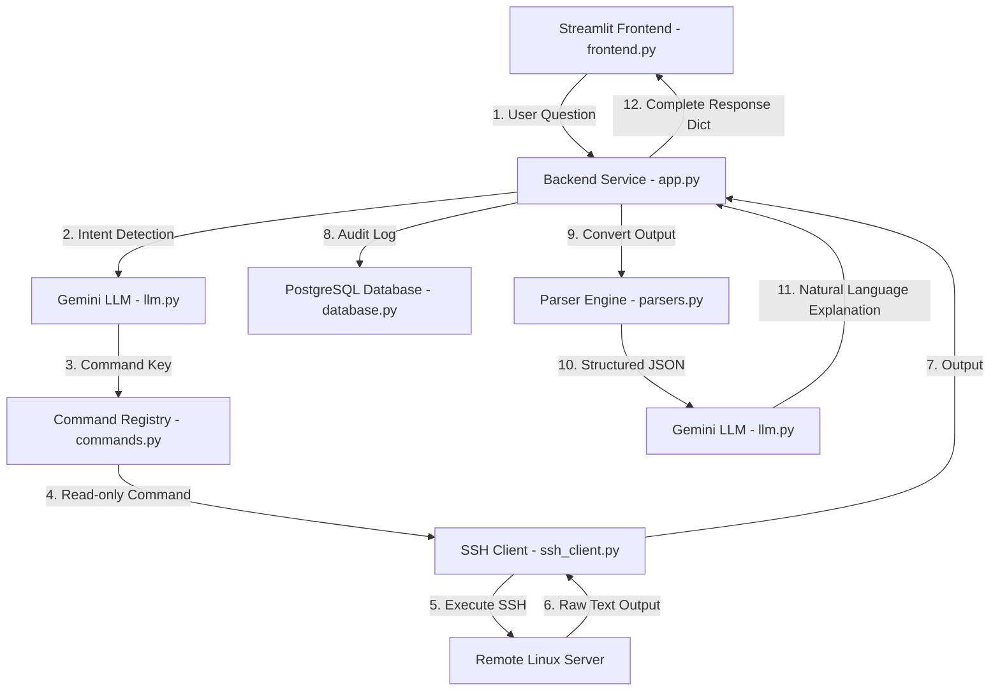

# 🖥️ Linux Server AI Assistant

> **A natural language monitoring and diagnostic assistant for Linux servers, powered by Google Gemini, Paramiko SSH, PostgreSQL, and Streamlit.**

---

## 📌 Overview

The **Linux Server AI Assistant** allows system administrators, DevOps engineers, and developers to monitor and inspect remote Linux servers using plain natural language questions. Instead of remembering complex CLI arguments, simply ask *"How much RAM is available?"* or *"Is the server under heavy load?"*.

The assistant maps natural language intent to safe, read-only system commands, executes them over SSH, converts terminal text into structured JSON data, and generates clear, human-friendly summaries.

---

## 🏗️ System Architecture



---

## 🔄 End-to-End Execution Flow

When a user asks: **"How much RAM is available?"**

```text
User Question: "How much RAM is available?"
        │
        ▼
┌──────────────────────────────────────────────────────────┐
│ Streamlit Frontend (frontend.py)                         │
└───────────────────────────┬──────────────────────────────┘
                            │  Passes question
                            ▼
┌──────────────────────────────────────────────────────────┐
│ Backend Service Orchestrator (app.py)                   │
└───────────────────────────┬──────────────────────────────┘
                            │  Calls get_command_key(question)
                            ▼
┌──────────────────────────────────────────────────────────┐
│ Gemini LLM Intent Detection (llm.py)                      │
│ Returns: {"command_key": "memory_usage"}                 │
└───────────────────────────┬──────────────────────────────┘
                            │  Lookup key
                            ▼
┌──────────────────────────────────────────────────────────┐
│ Command Registry (commands.py)                           │
│ Resolves: "free -m"                                      │
└───────────────────────────┬──────────────────────────────┘
                            │  Execute command
                            ▼
┌──────────────────────────────────────────────────────────┐
│ SSH Client (ssh_client.py) ──> Remote Linux Server       │
│ Returns: Raw terminal output string                      │
└───────────────────────────┬──────────────────────────────┘
                            │  Log execution
                            ▼
┌──────────────────────────────────────────────────────────┐
│ Audit Logger (database.py) ──> PostgreSQL                │
│ Inserts record into ssh_command_logs                     │
└───────────────────────────┬──────────────────────────────┘
                            │  Parse output
                            ▼
┌──────────────────────────────────────────────────────────┐
│ Parser Engine (parsers.py)                               │
│ Output: {"memory": {"total_mb": 7940, "available_mb": 5129}}
└───────────────────────────┬──────────────────────────────┘
                            │  Generate explanation
                            ▼
┌──────────────────────────────────────────────────────────┐
│ Gemini LLM Output Explainer (llm.py)                     │
│ Generates: "The server has ~7.9 GB RAM with 5.1 GB free."│
└───────────────────────────┬──────────────────────────────┘
                            │  Render response
                            ▼
┌──────────────────────────────────────────────────────────┐
│ Streamlit Frontend (frontend.py)                         │
│ Displays AI Response, Metrics, Command, Raw Output,      │
│ Parsed JSON, and Conversation History                    │
└──────────────────────────────────────────────────────────┘
```

---

## 📁 Project Structure

```text
paramiko/
│── app.py           # Backend service & end-to-end workflow orchestrator
│── frontend.py      # Streamlit Web UI Dashboard
│── commands.py      # Read-only command registry & example queries
│── ssh_client.py    # Paramiko SSH connection & execution manager
│── database.py      # PostgreSQL execution log manager
│── parsers.py       # Regex parser engine (Raw stdout -> Structured JSON)
│── llm.py          # Gemini AI API integration (Intent mapping & Summarization)
│── .env             # Environment variables & credentials
└── README.md        # Project documentation
```

---

## ✨ Features

- 🛡️ **Strict Read-Only Execution**: Prevents dangerous modifications by enforcing a strict command registry whitelist.
- 🧠 **Dual-Stage AI Processing**:
  - **Stage 1 (Intent Classification)**: Maps arbitrary user questions to predefined command keys.
  - **Stage 2 (Output Interpretation)**: Converts structured JSON metrics into concise, human-friendly insights.
- 📊 **Structured Data Parsing**: Regular-expression parser engine transforms raw CLI output (`df -h`, `free -m`, `uptime`, `hostname`, `whoami`, etc.) into clean JSON objects.
- 📜 **PostgreSQL Audit Trail**: Logs every command, server host, output, error, and timestamp to a database for auditability.
- 🎨 **Modern Streamlit Dashboard**: Includes expandable command examples by category, real-time performance metric badges, raw output inspection, and session conversation history.

---

## 🚀 Getting Started

### 1. Prerequisites

- Python 3.11+
- PostgreSQL database instance
- Remote Linux server with SSH access
- Google Gemini API Key

### 2. Installation

Clone the repository and install required packages:

```bash
# Clone the repository
git clone https://github.com/your-username/paramiko-ai-assistant.git
cd paramiko-ai-assistant

# Create and activate virtual environment
python -m venv myvenv

# Windows (PowerShell)
.\myvenv\Scripts\activate

# Linux / macOS
source myvenv/bin/activate

# Install dependencies
pip install streamlit paramiko psycopg2-binary google-genai python-dotenv
```

### 3. Environment Configuration

Create a `.env` file in the root directory:

```env
# SSH Target Server Credentials
SSH_HOST=127.0.0.1
SSH_PORT=22
SSH_USERNAME=your_ssh_user
SSH_PASSWORD=your_ssh_password

# PostgreSQL Database Configuration
DB_HOST=localhost
DB_PORT=5432
DB_NAME=postgres
DB_USER=postgres
DB_PASSWORD=postgres

# Google Gemini API
GEMINI_API_KEY=your_gemini_api_key
```

### 4. Running the Dashboard

Launch the Streamlit frontend application:

```bash
streamlit run frontend.py
```

The application will be accessible in your web browser at `http://localhost:8501`.

---

## 📖 Component Breakdown

| Module | Responsibility |
| :--- | :--- |
| **`frontend.py`** | Streamlit UI containing question input, metric badges, category expanders, and session history. |
| **`app.py`** | Reusable backend function `ask_server(question)` orchestrating the complete lifecycle. |
| **`llm.py`** | Integrates with `google-genai` to classify user questions and explain structured JSON output. |
| **`commands.py`** | Central registry of whitelisted Linux commands with categories and example prompts. |
| **`ssh_client.py`** | Manages `paramiko.SSHClient` lifecycle and remote command execution. |
| **`database.py`** | Manages PostgreSQL connection and logs execution history to `ssh_command_logs`. |
| **`parsers.py`** | Transforms raw terminal stdout into JSON dictionaries (e.g. memory breakdown, filesystem metrics). |

---

## 📝 License

Distributed under the MIT License.
